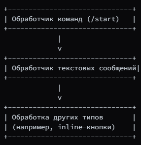
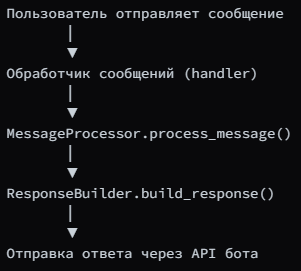
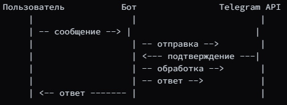

# Подробное описание создания Telegram-бота

## 1. Исследование предметной области и постановка задачи
### Цель проекта
Создать универсального Telegram-бота, который сможет:

* Обрабатывать команды и сообщения пользователей
* Предоставлять информацию или выполнять действия по запросу
* Использовать меню с кнопками для навигации
* Быстро расширяться и адаптироваться под разные задачи

## 2. Исследование технологий
### Основные компоненты
* Python — язык программирования
* pyTelegramBotAPI (или telebot) — библиотека для работы с Telegram API
* dotenv — для хранения конфиденциальных данных (например, токена)
### Инструменты и ресурсы
* Telegram BotFather — создание бота и получение токена API
* Python — установка интерпретатора
* Git — управление версиями кода

## 3. Создание прототипа бота: пошаговая инструкция
### Шаг 1: Регистрация бота в Telegram
* Откройте чат с BotFather
* Отправьте команду /newbot
* Следуйте инструкциям: укажите имя и username бота
* Получите токен API (например, 123456789:ABCdefGHIjklMNOpqrSTUvwxYZ)

### Шаг 2: Настройка окружения разработки
Установите необходимые библиотеки:
```pip install pyTelegramBotAPI python-dotenv```
Создайте файл с расширением .env для хранения токена:
```BOT_TOKEN=ваш_токен_от_BotFather```

### Шаг 3: Создание файла .py с базовым кодом
Инициализация
```
import os
import telebot
from dotenv import load_dotenv

load_dotenv('.env')
BOT_TOKEN = os.environ.get('BOT_TOKEN')

bot = telebot.TeleBot(BOT_TOKEN)
```
Обработка команды /start или /help
```
@bot.message_handler(commands=['start', 'help'])
def handle_start_help(message):
    bot.send_message(
        message.chat.id,
        "Здравствуйте! Я ваш бот. Выберите опцию или введите команду."
    )
```
Обработка текстовых сообщений
```
@bot.message_handler(func=lambda msg: True)
def handle_message(message):
    text = message.text.strip().lower()

    if text == 'привет':
        bot.send_message(message.chat.id, "Привет! Чем могу помочь?")
    elif text == 'информация':
        bot.send_message(message.chat.id, "Это пример универсального бота.")
    else:
        bot.send_message(message.chat.id, "Я не понимаю эту команду.")
```
Запуск бота
```
if __name__ == '__main__':
    print("Бот запущен")
    bot.infinity_polling() 
```

## 4. Иллюстрации и схемы

### Структура обработки команд и сообщений

#### Благодаря этому легко добавлять новые команды или функции.

### Последовательность обработки сообщения

#### Порядок вызовов функций при получении сообщения.

### Диаграмма последовательности

#### Показывает последовательность взаимодействий между пользователем, ботом и API.


