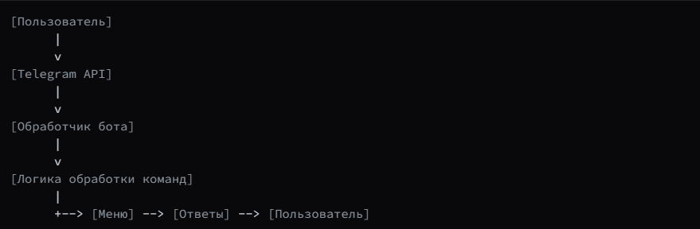
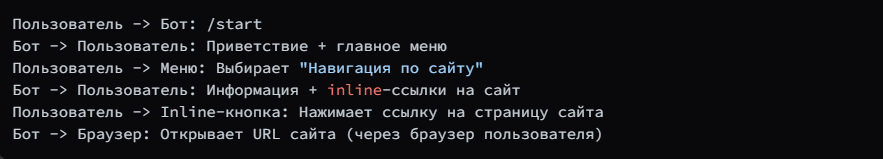
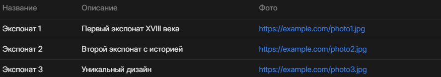

# 3. Техническое руководство

## Цель:  
Создать Telegram-бота на Python с меню, ссылками и описаниями экспонатов.

---

## Шаги:

# **Шаг 1: Установка окружения**


**Установка Python (если не установлен)**
**Загрузка и установка pip (если нужно)**

**Создайте виртуальное окружение**

python -m venv venv
source venv/bin/activate  # Linux/Mac
venv\Scripts\activate     # Windows

**Установка необходимых библиотек**
pip install pyTelegramBotAPI python-dotenv

# **Шаг 2: Создание файла .env с токеном бота**
```bash
BOT_TOKEN=ваш_токен_от_botfather
```
**Получить токен можно у BotFather.**

# **Шаг 3: Создание основного файла bot.py**
```bash
import os
import telebot
from dotenv import load_dotenv

load_dotenv('tocken.env')  # Загружаем токен из файла

BOT_TOKEN = os.environ.get('BOT_TOKEN')
if not BOT_TOKEN:
    raise ValueError("Токен бота не найден. Проверьте файл tocken.env.")

bot = telebot.TeleBot(BOT_TOKEN)

# --- Создаем клавиатуры ---

# Главное меню
main_menu = telebot.types.ReplyKeyboardMarkup(resize_keyboard=True)
main_menu.row('Навигация по сайту', 'Контакты')
main_menu.row('Описание экспонатов')

# Меню экспонатов
exhibit_menu = telebot.types.ReplyKeyboardMarkup(resize_keyboard=True)
exhibit_menu.row('Экспонат 1', 'Экспонат 2')
exhibit_menu.row('Экспонат 3')

def get_return_to_main():
    markup = telebot.types.ReplyKeyboardMarkup(resize_keyboard=True)
    markup.row('Вернуться в меню')
    return markup

def get_site_links():
    markup = telebot.types.InlineKeyboardMarkup()
    markup.add(
        telebot.types.InlineKeyboardButton("Главная", url="https://yourwebsite.com/index.html"),
        telebot.types.InlineKeyboardButton("О проекте", url="https://yourwebsite.com/about.html")
    )
    markup.add(
        telebot.types.InlineKeyboardButton("Журнал", url="https://yourwebsite.com/journal.html"),
        telebot.types.InlineKeyboardButton("Ресурсы", url="https://yourwebsite.com/resources.html")
    )
    markup.add(
        telebot.types.InlineKeyboardButton("Участники", url="https://yourwebsite.com/participants.html")
    )
    return markup

# --- Обработчики ---

@bot.message_handler(commands=['start', 'help'])
def start_help(message):
    bot.send_message(message.chat.id, "Здравствуйте! Выберите опцию:", reply_markup=main_menu)

@bot.message_handler(func=lambda msg: True)
def handle_message(message):
    text = message.text.strip()

    if text == 'Навигация по сайту':
        info = (
            "Доступные страницы сайта:\n"
            "- Главная\n"
            "- О проекте\n"
            "- Журнал\n"
            "- Ресурсы\n"
            "- Участники\n"
            "Вы можете перейти по соответствующим разделам на сайте."
        )
        bot.send_message(message.chat.id, info, reply_markup=get_site_links())

    elif text == 'Контакты':
        contacts = (
            "Контактная информация:\n"
            "Телефон: +7 123 456 78 90\n"
            "Email: info@politech.ru\n"
        )
        bot.send_message(message.chat.id, contacts, reply_markup=get_return_to_main())

    elif text == 'Описание экспонатов':
        bot.send_message(message.chat.id, "Выберите экспонат для описания:", reply_markup=exhibit_menu)

    elif text in ['Экспонат 1', 'Экспонат 2', 'Экспонат 3']:
        descriptions = {
            'Экспонат 1': ("Это первый экспонат. Он был создан в XVIII веке...", "https://example.com/photo1.jpg"),
            'Экспонат 2': ("Это второй экспонат. Он известен своей историей...", "https://example.com/photo2.jpg"),
            'Экспонат 3': ("Это третий экспонат. Он уникален своим дизайном...", "https://example.com/photo3.jpg")
        }
        desc, photo_url = descriptions.get(text)
        bot.send_message(message.chat.id, desc, reply_markup=get_return_to_main())
        bot.send_photo(message.chat.id, photo_url)

    elif text == 'Позвонить':
        bot.send_message(message.chat.id, "Позвоните по номеру: +7 123 456 78 90", reply_markup=get_return_to_main())

    elif text == 'Написать письмо':
        bot.send_message(message.chat.id, "Напишите нам на email: info@politech.ru", reply_markup=get_return_to_main())

    elif text == 'История экспоната':
        bot.send_message(message.chat.id, "История этого экспоната очень интересна...", reply_markup=get_return_to_main())

    elif text == 'Фотографии':
        bot.send_photo(message.chat.id, 'https://example.com/photo_exhibit.jpg', reply_markup=get_return_to_main())

    elif text == 'Вернуться в меню':
        bot.send_message(message.chat.id, "Вы вернулись в главное меню.", reply_markup=main_menu)

    else:
        bot.send_message(
            message.chat.id,
            "Извините, такой команды нет. Попробуйте выбрать из меню или используйте /help.",
            reply_markup=main_menu
        )

if __name__ == '__main__':
    print("Бот запущен")
    bot.infinity_polling()
```
## Иллюстрации (схемы):
Рисунок 1: Архитектура системы


Рисунок 2: Взаимодействие с пользователем через меню и inline-кнопки


Рисунок 3: Структура данных о экспонатах
